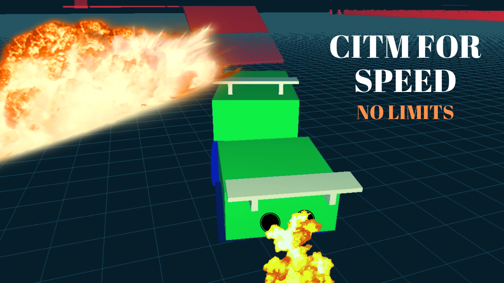

# PhysicsII-RaceCar CITM
We are 3 second year students from CITM University in Barcelona. We have been asked to develop a Racing Car game using OpenGL, Bullet and SDL libraries. 

There is at least one constrait of any type, we used a trooley in order to achieve this effect.

[GITHUB REPOSITORY](https://github.com/OCA99/PhysicsII-RaceCar)

#### 📷 Screenshot 📷

#### 🎌 GOAL 🎌
Your challenge will be to complete 3 Level of the Game without running out of lifes. You will have 3 lifes on each level.

**Lvl 1**: Complete 3 Laps.

**Lvl 2**: Complete the Path without falling.

**Lvl 3**: Complete the Path without falling.

#### 🕹️ Controls 🕹️

**⬇⬆⬅➡**: Move the car.

**T**: Play the Horn.

**P**: Restart the Game

**DEBUG-R**: Skip to the next Level.

**DEBUG-Space**: Respawn the car.

**DEBUG-F1**: See Sensors.

#### 🛠️ Developers 🛠️

- [Oscar Cuatrecasas - developer, testing.](https://github.com/OCA99) 

- [Aitor Álvarez - developer, music.](https://github.com/AitorAlvarez17) 

- [Telmo Beroiz - developer, art.](https://github.com/Telmiyo) 

#### ⚖️ Licence ⚖️

This project is licensed under an unmodified MIT license, which is an OSI-certified license that allows static linking with closed source software. Check LICENSE for further details.

[SDL License](https://www.libsdl.org/license.php)

[BULLET License](https://opensource.org/licenses/Zlib)

[OPENGL License](https://www.opengl.org/about/#11)
